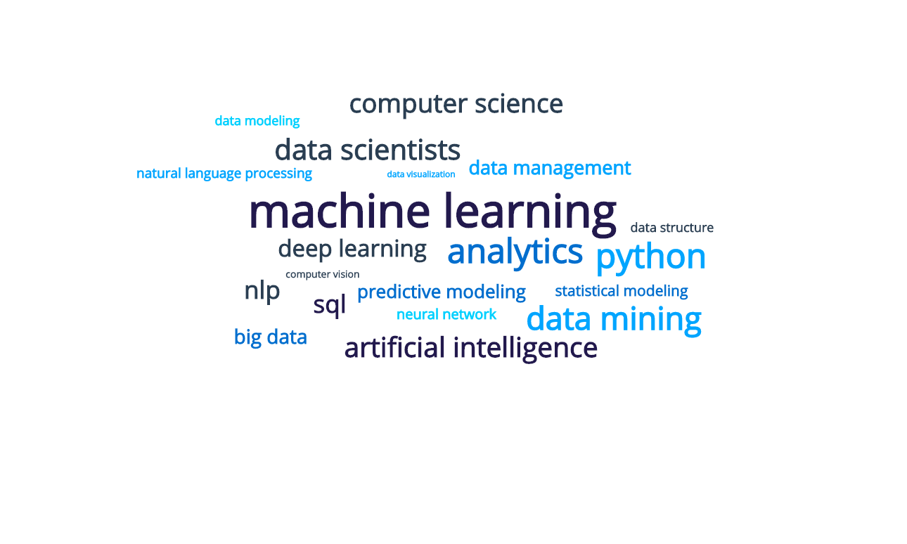
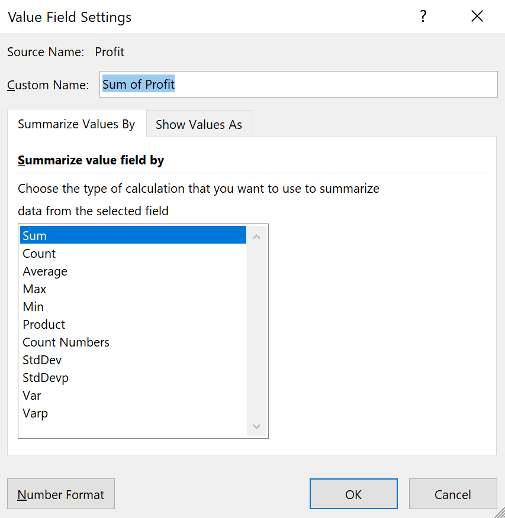

# 1.1 Introduction to Course, Exploring/Plotting with Excel

## Overview

In this class, students will become familiar with the class structure and course topics. In addition, students will learn about ways to utilize Excel for a data science workflow.

## Class Objectives

By the end of class, students will:

* Understand the course structure and general direction of the program
* Import and manipulate tabular data using Excel
* Implement pivot tables to summarize tabular data in Excel
* Create line, bar and scatter plots to visualize tabular data in Excel

## Class Outline

| | Topic | Time |
| -- | -- | -- |
| 1. | [Welcome To Class](#Section1) | 60 Mins |
| 2. | [Time to Excel in Data Science](#Section2) | 35 Mins |
| 3. | [Break](#Break) | 15 Mins |
| 4. | [Pivoting over to Pivot Tables](#Section3) | 25 Mins |
| 5. | [Visualizing Tabular Data in Excel](#Section4) | 40 Mins |
| 6. | [Review, Recap & End Class](#Section5) | 5 Mins |
| 7. | [Skill Drill](#Skill_Drill) | |

> Total Time: 180 mins

## Instructor Prep

  
<strong>⭐ Notes for Today </strong>

* First off, welcome! Thank you for being a part of our program. Because of instructors and TAs like you, we're helping students achieve their goals and creative dreams. You've got a long road ahead and plenty of time to make an impact.

* It's important to set the right tone on the first day, so come to class prepared. You are encouraged to practice aloud at home and think through your presentation carefully. This doesn't mean you need to memorize the lesson word for word, but do become very comfortable with the material. On the first day, students will be more aware of any signs of unpreparedness. Later, when you've established rapport with your students, you can lighten your preparation a bit.

* In today's class, students may say, "Excel is too simple", or they may ask, "when will I ever use this in an actual industry job?" Feel free to provide your own experience or response, but as we as 2U and Netflix put our heads together to create a comprehensive applied data science and engineering boot camp, we identified Excel skills as a critical tool to interface between analysts and management. 

* When the lesson plan calls for files to be sent to students there are a few ways to do so. For the first couple of days it may be easiest to use Slack, but as the files and directories get more complex you may look to try alternate methods such as pushing and pulling from GitHub/GitLab and sending out the link, using a file storage like Google Drive, or zipping up files and continuing to Slack out. Please use whatever method you find most comfortable for sending files out to students.

* For the first units of the course, each Student-Do will include bonus "stretch goals". Any student who has completed the required goals for the activity is encouraged to challenge themselves and attempt the bonuses in the time allotted. These bonuses are designed to further explore the functionality and use-cases of our analytical tools and empower students to expand their technical prowess. Be aware that many of these bonuses will not be directly covered in the previous activities and will require some form of reading through documentation, Stack Overflow or Googling. 

  
<strong>⭐ General Class Notes </strong>

### General Class Notes

* For each class, you will be provided a Lesson Plan outline (this document), activity folders to accompany each activity (including solved and unsolved versions of the materials), as well as a [slideshow](https://docs.google.com/presentation/d/1ht7k1V51YTw6RDIbqkv_-BThVhxLIG2SG8N9qAfm3Fg/edit#slide=id.g8fb1177054_0_5) that can be used to help facilitate the presentation for the day. You are encouraged to use the slideshow to help students follow along with the class activities and to assist the engagement of students who are more visual learners.

* Feel free to distribute these slides to the students before or after class. However, the links to the slideshows are for instructor-use only. When distributing slides to students, please first export the slides to a PDF file and then send out the PDF file.

* Have fun and enjoy the ride!

### Slideshow

The lesson slides for this document are available on Google Drive here: [1-1 Slides](https://docs.google.com/presentation/d/1ht7k1V51YTw6RDIbqkv_-BThVhxLIG2SG8N9qAfm3Fg)

---

## Class Activities

### 1.  Welcome To Class

| Activity Time:       1:00 |  Elapsed Time:      0:00  |
|---------------------------|---------------------------|

  
<strong>📣 1.1 Instructor Do: Class and Instructor Introductions (0:30)</strong>

 

The first part of class consists of introductions from the university and program director, instructor and TAs.

Once you and the TAs have given your introductions, have every student in class introduce themselves. Feel free to refer to the slides or come up with questions of your own. Try to keep things lighthearted as students share their backgrounds.

<!---
TODO: **Potential Netflix intro statement**
-->

  
<strong>📣 1.2 Instructor Do: Hitting the Ground Running with Data Science (0:15)</strong>

 

Now that introductions are finished, we'll begin the lesson by providing a glimpse into the past 20 years of data science in industry. Using the slides, cover the following: 

* The landscape of data is far reaching. Within the past 20 years, the collection, storage and analysis of data has experienced unprecedented acceleration and change. So much so that it does not make sense for us to focus on anything data-related prior to the the early 2000's.

  * From the early 2000s through the 2010s, data science seemed like a free-for-all. Everyone had their favorite language, toolkit, proprietary data solution, analysis pipeline, etc.

  * In these times, data scientists would use whichever language had the most robust solution. This meant that they would be expected to use multiple programming languages to complete a simple data workflow: start with a Java or Ruby script to manipulate SQL queries, move to a C or C++ script to perform statistical modelling, and then back to Java or R (cutting edge at the time) to create a visualization or to generate a report.

  * There were no collaborative, open-community forums for programming such as StackOverflow, which meant *hours* of traversing through documentation and then testing each and every step of the way. 
  
* Within the past 10 years Python has changed the entire landscape of data science and programming as a whole.

    * By combining open-source programming and easy to interpret language syntax, Python has become the most popular programming language in the world for data scientists.

    * With higher adoption rates comes more robust libraries and modules for us to use. Many popular data analysis tools in Java, SQL, R and C have been implemented in Python, which simplifies analysis logistics and the number of languages required by a data team.

    * The rise of Stack Overflow has revolutionized programming, troubleshooting and implementation. As a result, best practices become more common and more accessible than ever before.

* The job market has evolved as more and more companies utilize a Python-centric workflow.

  * Across the top 20 skills required by data science roles in 2020, Python and its powerful data science libraries can be used to master each and every one. 

   

  
<strong>📣 1.3 Instructor Do: Class Syllabus and Grading Expectations (0:15)</strong>

 

After walking the students through the evolution of data science in the past 20 years, establish class expectations.

* The purpose of this class is to take all of the relevant skills and techniques used by current tech industry jobs and bring them to you in a easy-to-digest format:

    * In-class programming exercises 

    * Case studies and mini-projects

    * Take-home skill drills (homework) and unit assessments (tests)

    * Three portfolio group projects

* In addition to the technical, statistical, machine learning and database design skills, critical soft skills will also be covered:

    * Collaborative design and version control skills using Git and Github

    * Agile work environment skills

    * Technical presentations and public speaking skills

* Review the class structure: 

  * Two days of classes per week, 
  
  * Skill drills or unit assessment after every class in lieu of homework
  
  * Projects at the end of modules

  * Note: It is recommended that you make the skill drills due 48 hours after the end of the class it is assigned. Unit assessments should be due by the end of the week they are assigned.

* Show students the class syllabus.

    * [Current Class Syllabus](Resources/NSU_Syllabus-Netflix_Applied_Data_Science_Boot_Camp.pdf)

    * Run through the high-level descriptions and objectives of each module.

* Grades for the course will be determined by the following factors:

    * Attendance and class participation - 10%

    * Daily skill drill turn-ins (pass/fail grading) - 10%

        * [Skill Drill Grading Rubric](https://docs.google.com/document/d/11L3XqOemkJ5STCJg27NoHOnTRo1t8mO33HBE9FE953k)

    * Unit Assessments - 20%
      
      * 7 assessments in total, lowest unit assessment score should be dropped

    * Project participation and deliverables - 60%

      * Note that the project grade is based upon student project submission and group presentation criteria.

      * Project 1 and 2 are each worth 15% of a student's total grade.

        * [Project 1 Grading Rubric](https://docs.google.com/document/d/1y3-B0ufh1QjUB5RmjakyN2jSRbiZtr4VC28JVMgU4-Y)

        * [Project 2 Grading Rubric](https://docs.google.com/document/d/1nPDWZVSuAFzkzinFQ5QapMQY-L81thkjiny5_EcIDgA)

      * Final project is worth 30% of a student's total grade.

        * [Final Project Grading Rubric](https://docs.google.com/document/d/1vMmqem92nEJuSfl4-CqHNOQy4OmAwV9k7RtySyukduM)

* Walk through each rubric and point out a sampling of criteria that will be used to grade student submissions. 

---

### 2.  Time to Excel in Data Science

| Activity Time:       0:35 |  Elapsed Time:      1:00  |
|---------------------------|---------------------------|

  
<strong>📣 2.1 Instructor Do: Excel Fundamentals (0:10)</strong>

   

Now it's time to teach our very first learning objective towards data science proficiency - Excel! Although some students may be familiar or even power users of Excel, it is important to reinforce good habits with this tool and ensure that every student knows when and where to use Excel in an industry position.

Use the slides to cover the following material. When directed, switch from the slideshow presentation to the linked Excel activity book. 

* Excel has multiple purposes - as a data source, as analysis and calculations tool, or as a visualizer.

* Although data scientists will not use Excel for the majority of their analysis, testing, and reporting, it still serves a purpose when looking at tabular data (data stored in a table format) at a high level or quickly manipulating and cleaning a small dataset.

* In industry, many non-data people rely on Excel for data visualization, analysis and reports. Even though analysis and visualization in Excel is not very scalable or practical, it is vitally important that we understand how to clean, manipulate and visualize data. You never know when you will be asked to produce these types of analysis for a peer, a manager or an executive.

    * Today we will look at some of the most useful functions of Excel in order to provide an overview of our dataset.

* **Functions** are the backbone of any analysis in Excel. They are similar to a function in most object-oriented programming language and they contain **arguments** and **variables**. 

* Functions in Excel are mostly predefined, and can be invoked within an Excel spreadsheet by using the `=` operator.

* Logical tests like **equals** and **greater than** or **less than** do not use formulas. Instead, they use operators and return **True** or **False**.

#### Excel Formula Demonstration

In the following demonstration, we will use Excel to review basic formulas. Open up the [Excel activity book](Activities/01-Ins_ExcelPlayground/Solved/Excel_Fundamentals.xlsx) or use the images in the slideshow.

1.  We can check if values and columns are equal using the `=` conditional operator.

    * Note that this is different from the `=` operator used to create an Excel function.

    * Demonstrate checking if two student's Exam 1 scores are equal using `=G2=G4`.

    * Demonstrate checking if student's scores are equal from Exam 1 to Exam 2 using `=G2:G10=H2:H10`.

2. We can check if a substring is within a string by using a combination of the `SEARCH` and `ISNUMBER` functions. 
  
    * The `SEARCH` function returns the position of the first match of the search text (substring) within a cell. If the substring does not exist in the cell it returns a value error.

    * We can combine the output from the `SEARCH` function with the `ISNUMBER` function. The `ISNUMBER` function simply checks if a cell is a number. 
    
    * If we put these functions together and the substring is found, then the `ISNUMBER` function will return `TRUE`. If the substring is not found, then the `ISNUMBER` function will return `FALSE`. 

    * Demonstrate searching for "bio" from the student's "Major" list using `=ISNUMBER(SEARCH("bio",F2))`

3. We can also apply mathematical formulas to any cell or range in Excel.
  
    * For example, we can calculate each student's final grade on a four point scale using mathematical manipulation and the `AVERAGE` function. 

    * Demonstrate calculating the student final score and converting to a four-point scale using `=(AVERAGE(G2:J2)/100) * 4`

4. Often times when working with dates and time, we need to convert formats or structure. Converting DateTime from one format to another is simple in Excel. 

    * Demonstrate switching between short date format and long date format in the example Excel activity book.

    

5. Another handy feature in Excel is splitting a column with strings using a delimiter.

    * In data science, a delimiter could be helpful when extracting directories and files from an absolute file path, or when separating out elements in a comma-separated list.

    * Demonstrate splitting student first and last names in the Excel activity book.

    

6. Conversely, we may need to combine values across columns to create a new value. This can be performed by using the ampersand `&` operator in a formula.

    * Demonstrate combining the student name and ID columns into a new identifier column in the Excel activity book using the formula `=E2&"_"&A2`. 

7. Finally, explain that one of the easiest ways to interpret data in Excel is by using **conditional formatting**. 

    * Conditional formatting is applying visual styling, such as background color, font, or text color, to a range of cells based on their values (or even lack-there-of!)

    * Conditional formatting is often used to highlight values that are outside of a specified range or past a specific threshold. Sometimes, conditional formatting is used if there are missing data points.

    * Demonstrate using conditional formatting to highlight scores.

     

Point out that there are many, many more ways to use Excel for data exploration and we are only scratching the surface in this course.  

  
<strong>✏️ 2.2 Student Do: Cleaning Up in Excel (0:15)</strong>

 

For the very first student activity of the course, students will use Excel tools to clean up a dirty dataset.

* You may use the slideshow to accompany this and all future activities. Be sure to mention the following before distributing the files:

  * This activity, along with all of today's activities, includes basic, mandatory instructions. There are optional bonus instructions for those who finish early or want an additional challenge.

  * **Note:** The time alloted for this activity is for the basic instructions. Time is not allocated for students to complete the bonus instructions.

* **Files:**

  * [README](Activities/02-Stu_Cleaning_Up_Excel/README.md)

  * [04-Stu_GradeBook/GradeBook_Unsolved.xlsx](Activities/02-Stu_Cleaning_Up_Excel/Unsolved/Cleaning_Up_Excel.xlsx)

#### Instructions:

1. Create a new column in the Excel spreadsheet that converts the Order Total (CAD) from the Canadian Dollar (CAD) to the United States Dollar (USD). 
    
    * For this activity we will assume that $1 Canadian Dollars is equal to $.77 US Dollars.

2. Create another new column that determines if an order contains fresh produce in the Products Ordered column.

3. Create another new column that calculates the estimated delivery date from the Order Date column. 

    * If an order contains fresh produce, the estimated delivery date should be three days after the order date, otherwise the estimated delivery date should be 14 days after the order date.

4. Split the Products Ordered column into separate columns using the `^` delimiter. Add the split columns to the end of the Excel sheet.

5. Add conditional formatting to the Excel sheet to highlight if a order contains fresh produce. 

#### Bonus:

6. Add custom conditional formatting to color-code each type of product ordered within an order.

7. Add a filter to the Excel sheet to only show orders that cost more than $50 US Dollars.

  
<strong>⭐ 2.3 Review: Cleaning Up in Excel (0:10)</strong>

 

Take some time to walkthrough the previous activity and make sure you answer any student questions before moving on. 

---

###  Break

| Activity Time:       0:15 |  Elapsed Time:      1:35  |
|---------------------------|---------------------------|

---

### 3.  Pivoting over to Pivot Tables

| Activity Time:       0:25 |  Elapsed Time:      1:50  |
|---------------------------|---------------------------|

  
<strong>📣 3.1 Instructor Do: Pivoting in Excel (0:10)</strong>

 

Now it's time to cover one of the most powerful and useful tools that a data scientist can harness in Excel - pivot tables. A surprising number of professionals in tech and biotech industries know how to read and interpret pivot tables. Therefore, it is important to know how to build these tables in order to present data to a wider audience. As an added bonus, in this section, we will introduce basic summary statistics and concepts that will re-emerge when we cover statistical analysis in Python. 

Introduce pivot tables by covering the following:

  * One of the most useful features in Excel, and the biggest differentiator between people who casually use Excel to capture data and those who use Excel to explore their data, is the **pivot table**.

  * Pivot tables are summary tables within Excel that calculates summary statistics across factors defined by the user.

#### Pivot Table Demonstration

In this demonstration, we will use Excel to create pivot tables. Open up [03-Ins_PivotTables/PivotTables_Solved.xlsx](Activities/03-Ins_PivotTables/PivotTables_Solved.xlsx).

1. In order to create a pivot table, simply select Pivot Table within the Insert tab and then hit OK in the new window that pops up.

    * A menu appears where users choose which columns from the original sheet they would like to place into their pivot table.

2. Place Product into the Rows section. Excel will create a column of all products, consolidating all duplicate data points. 

    * Users can also group rows into subcategories by adding more fields into the Rows section. This feature will allow for more specific or more generalized tables. 

   

3. Place Profit into the Values section. A new column will appear containing the sum of the Profit column from the original spreadsheet as it relates to the Product column. 

    * In other words, all "Apple" values are added together, all "Banana" values are added together, etc.

4. Users can change what kind of data they analyze within a pivot table by clicking on any of the fields placed within the Values section and selecting **Field Value Settings** from the drop down menu. This allows users to look at maximums, minimums, averages, and much more.

   

5. Place Country into the Filter section. A new field listed as Country will appear above the pivot table. By clicking on this field and selecting a value from the menu that appears, users can filter data based upon what sales took place in a particular country.

   

6. Users can also sort tables by selecting any single cell, then right-clicking. Within the pop-up menu, select **Sort**, and choose the desired sorting method.

Check if anyone has any questions before moving onto the next section. 

  
<strong>✏️ 3.2 Student Do: Top Songs Pivot Table (0:10)</strong>

 

In this activity, students will create a pivot table to summarize metadata surrounding the top 5000 songs between 1901 and 2015. 

* **Files:**
 
  * [README](Activities/04-Stu_TopSongsPivot/README.md)

  * [04-Stu_GradeBook/GradeBook_Unsolved.xlsx](Activities/04-Stu_TopSongsPivot/Unsolved/Top5000Songs_Unsolved.xlsx)

#### Instructions:

1. Select all of the data within your worksheet and create a new pivot table.

2. Make a pivot table with the follow criteria: 
  
    * Contains two rows: artist and name.
  
    * Can be filtered by year.

    * All of an artist's songs should be listed underneath their name.

3. Update your pivot table to contain values for:

    * How many songs an artist has in the top 5000.

    * The sum of the final_score of their songs.

4. Sort your pivot table by descending sum of the final_score.

#### Bonus:

5. Add three additional summary columns for the average raw_usa, average raw_eng and average raw_eur.

6. Find the artist with the overall highest sum of final_score, copy the entire section of the artist and their songs from the pivot table to a new sheet. 

7. Determine the song with the top average raw_usa, average raw_eng and average raw_eur scores. Highlight the row(s) that contain the top songs.

  
<strong>⭐ 3.3 Review: Top Songs Pivot Table (0:05)</strong>

 
Take some time to walkthrough the previous activity and make sure you answer any student questions before moving on.

---

### 4.  Visualizing Tabular Data in Excel

| Activity Time:       0:40 |  Elapsed Time:      2:15  |
|---------------------------|---------------------------|

  
<strong>📣 4.1 Instructor Do: Getting the Picture With Excel (0:25)</strong>

 

In this section, you will teach students how to build basic visualizations such as line, bar and scatter plots in Excel. Like pivot tables, these plots are often used by the non-data population in order to visualize their data. Therefore it is important to reinforce these concepts in order for students to hone their ability of visualizing their data on-the-fly to a wider, non-technical population. We will not spend too much time on any single Excel method in today's class because we won't rely on Excel to convey meaningful visualizations - we will use Python for that.  

#### Line, Bar and Scatter Plots Demonstration

In this demonstration, we will build basic line, bar and scatter plots in Excel. You will carry out this demonstration in three separate workbooks each linked below. 

1. Using the [IceCreamFavesIceCreamFaves.xlsx](Activities/05-Ins_BasicVisExcel/IceCreamFaves.xlsx) file, select all of the data in columns A and B. Your selection should include the header rows containing the column labels and all rows containing data. Then navigate into the **Insert** tab at the top of the application to display all of the charting options that are available in the Charts group.

   * **PC**

     

   * **Mac**

     

2. Select a **bar chart**. Excel allows its users to create many kinds of charts, but first we'll focus on bar chart since that fits our data nicely.

    * Bar charts are especially helpful when visualizing a set of measurements across different categories or named values.

3. When selecting a charting option from the Charts group, a new menu will appear that allows us to select various visual options. In the case of bar charts, we can choose between 2D or 3D visuals with a horizontal or vertical layout.

    * For now, just stick with a vertical 2D chart since it is the most basic.

4. Once a chart option has been selected, a new chart will automatically be placed in the spreadsheet. Clicking on this chart will allow us to edit it and, if we so wished, we could double-click on any one element to edit that piece more specifically.

    * For now, click on the chart's title to show your students that we can rename the chart whatever we would like. (Note that its title may be a generic "Chart Title" if you did not include the header rows in your selection).

5. Next, add elements to the bar chart. PC and Mac instructions vary. Follow whichever steps align with your computer. 

    * If you are on a **PC**, follow these steps: 

      * Next, click on the plus sign to the right of our chart. This brings up a list of elements we can add/remove. Some of these elements have sub-elements which we can choose from as well.

      

      * Click on the **Axes Titles** option to add in titles for both our vertical and horizontal axes. Then click on the arrow to the right of the Axes Titles option to bring up the sub-menu, which allows us to choose the specific titles we would like to show.

      * By clicking on the paint brush to the right of a chart, we can choose a number of basic visual styles from a list. We can also select a color scheme for our chart by selecting a palette from the Color group.

      

      * Selecting a new color palette may not seem to make much of a difference at first, but if we double-click on the bars of our chart a new menu will appear at the side of the application that allows us to format our bars. If we then click on the paint can and select the "Vary colors by point" option, each bar will be given a different color that fits the palette we selected for our chart earlier.

   * In you are on **Mac**, follow these steps:  

      * Click on **Add Chart Element** on the left side of the ribbon and move down to **Axis Titles**. Here, you can select **Primary Horizontal** or **Primary Vertical**.

      

      * Click on **Change Colors** on the ribbon to changes the colors of the bar graph. This button is located to the right of the **Add Chart Element** option.

      * Double click on any of the bars to bring up the **Format Data Series** menu. Here we can check the **Vary colors by point** option that will give each bar a different color.

      

6. Point out that the format menu for a chart element can be brought up by double-clicking on any specific element. This gives us even more control over the look of our chart. 
  
    * Note: The exact location of the formatting control may differ between versions of Excel.

7. Next, we'll focus on the **line plot**. However, the data we currently have is not exactly ideal for creating this new plot. Ask the class: "Why is our data not ideal for a line plot?".

    * Our data does not take multiple measurements across a single variable such as time, which is ideal for a line plot. It instead compares a single data point across multiple named categories.

8. In order to practice visualizing a line plot with correct data, open [05-Ins_BasicVisExcel/BasicCharts.xlsx](Activities/05-Ins_BasicVisExcel/BasicCharts.xlsx) in Excel and go to the second sheet named Ice Cream Sales. This sheet contains data which shows how many scoops of ice cream flavors have been sold over a period of a year.

9. Select all of the data on this sheet and then select a 2D line chart from the **Charts** group on the **Insert** tab. 
  
    * Note: The selection should include the rows and columns containing labels.

    

10. From glancing at the chart, the class should notice just how cluttered it appears to be, making it difficult to extract any information. In order to make this chart more effective, we'll need to filter the rows. 

    * **PC**: To filter the rows you'd like to show, choose the third option to the right of chart. This allows us to filter what categories of data we would like to show.

    * Select a few ice cream flavors from the list and then hit **Apply** to filter some data for our chart.

    * **Mac**: To filter what is shown on the chart, choose the **Home** tab, select column **A**, and click **Sort & Filter** in the right of the toolbar. This option may be hidden in the Editing tab at certain screen sizes. Once your column is in filter mode, click the arrow dropdown in its header cell. Then, you will see options for sorting and filtering.

      

      * Select a few ice cream flavors from the list and show how the chart updates.

    * It is important to note that the filter options listed here are only helpful in certain cases. These limited filters will not help us when we need to filter out data based upon condition like greater than or less than.

11. Next, we'll look at the **scatter plot**. This plot consists of a scattering of points on a graph and is extremely useful when searching for relationships between two variables.

12.  Once again, our previous dataset is not sufficient for a scatter plot. Therefore we need to open [05-Ins_BasicVisExcel/ScatterPlot.xlsx](Activities/05-Ins_BasicVisExcel/ScatterPlot.xlsx) in Excel and navigate into the Normal Trend worksheet. This scatter plot compares an individual's salary to the price of their car.

13. Scatter plots become even more helpful when we apply a trend line to them. This allows us to further visualize the positive or negative relationship between our variables by plotting a line which best fits our data.

    *  To create a trendline, right-click on any data point within our scatter plot. In the right-click menu, select **Add Trendline...**

     * Note that Excel will create a **y=x linear trendline** by default. However, other types of trendlines may fit some data sets better. Encourage students to do their own research as to when and where they would apply different types of trendlines.

Be sure to answer any student questions before moving on.

  
<strong>✏️ 4.2 Student Do: Line, Scatter and Bars, Oh My! (0:10) </strong>

 

In this activity, students will be provided with three scenarios and datasets. For each scenario, students will decide if a line, bar or scatter plot is most appropriate to visualize the data. Then they will use Excel to create each visualizations. 

* **Files:**

  * [README](Activities/06-Stu_LineScatterBars/README.md)

  * [06-Stu_LineScatterBars/LineScatterBars_Unsolved.xlsx](Activities/06-Stu_LineScatterBars/Unsolved/LineScatterBars_Unsolved.xlsx)

#### Instructions:

1. Select the first sheet within the [activity workbook](Unsolved/LineScatterBars_Unsolved.xlsx) titled Video Game Sales. This dataset contains the average unit sales and review scores for a wide variety of video game titles.

   * For this dataset, create a plot that compares the Global_Sales column against the NA_Sales column.

   * **Hint:** Which plot is best for comparing two variables?

2. Next, select the second sheet in the activity workbook titled Student Grades Over Semester. This dataset contains a list of students' GPA scores over the course of six months.

   * For this dataset, create a plot that visualizes a single student's GPA across all 6 months.

   * **Hint:** Which plot best visualizes the changes of a single variable over time?

3. Lastly, select the third sheet in the activity workbook titled Pidgeon Racing. This dataset contains race results from a pigeon race by the American Racing Pigeon Union. 

   * For this dataset, first create a pivot table that looks across all breeders and counts up the sum of all entries per breeder.

   * Using this pivot table, create a plot that visualizes the sum of entries per breeder.

   * **Hint:** Which plot best visualizes measurements across categorical or named values?

#### Bonus

4. Go back to the second sheet in the workbook Student Grades Over Semester. Create a new plot that visualizes multiple student GPA scores over the course of six months.

5. Using the Pigeon Racing dataset, create a new pivot table that calculates the average speed of the pigeons by sex. Create a plot that best visualizes the comparison between average speed and sex of the pigeon.

  
<strong>⭐ 4.3 Review: Line, Scatter and Bars, Oh My! (0:05)</strong>

 

Take some time to walkthrough the previous activity and make sure you answer any student questions before moving on.

* Be sure to cover the following talking points:

  * For the first dataset, Video Game Sales, we are comparing two numerical, continuous variables. Our best visualization would be a scatter plot with a linear trendline.

  * For the second dataset, Student Grades Over Semester, we are visualizing the changes of a student's GPA over time. When dealing with data that is taken over a time-interval, we can actually use line, bar or even scatter plots. However, the line plot is the best choice to visualize this data because it provides additional context between each data point such as the direction and magnitude of change in a student's GPA. 

  * For the third dataset, Pigeon Racing, we need to visualize the sum of entries per breeder, which is a single measurement across named values (our breeder names). Therefore our dataset is best visualized with a bar plot. 

* Explain to students that selecting the best visualization for your data is as much an art form as it is data science. 
  
    * We will revisit how to create visualizations in a few weeks when we learn about tools such as Matplotlib and Plotly. 
    
    * There will be plenty of time to practice building effective visualizations for your data!

--- 

### 5.  Review, Recap & End Class 

| Activity Time:       0:05 |  Elapsed Time:      2:55  |
|---------------------------|---------------------------|

  
<strong>📣 5.1 Instructor Do: Answer Questions and End Class (0:05)</strong>

 

Review today's class objectives:

  * Understand the course structure and general direction of the program

  * Import and manipulate tabular data using Excel
  
  * Implement pivot tables to summarize tabular data in Excel
  
  * Create line, bar and scatter plots to visualize tabular data in Excel

In the next class, we will review Python programming and practice writing some Python functions and workflows in order to get us ready to start analyzing data.

Answer any lingering questions before dismissing class. 

  

---

### 6.  Skill Drill Take Home

  
<strong>📣 6.1 Student Do: Product Pivot Table Skill Drill</strong>

 

In the student's first take-home skill drill activity, they will practice summarizing and visualizing a product order form dataset.

* **Files:**

  * [README](../../../02-Assignments/01-Introduction/01-Exploring_Plotting_Excel/README.md)

  * [02-Assignments/Unsolved/ProductionPivot_Unsolved.xlsx](../../../02-Assignments/01-Introduction/01-Exploring_Plotting_Excel/Unsolved/ProductionPivot_Unsolved.xlsx)

#### Instructions:

1. Create a new column that adds together the `Price` and `Shipping Price` columns. Name this newly calculated column `Total`.

2. Make a pivot table using all of the data from the `Order` sheet that satisfies the following requirements:

   * Calculate the total number of orders (count) for each `Customer ID`.

   * Highlight the `Customer ID` that has the largest number of orders. 

   * **Note:** There should be a grand total of 600 orders across all `Customer ID`.

3. Return to the original `Order` sheet and create a new pivot table that satisfies the following requirements:

   * Calculate the total number of orders for each `Product Name` _and_ `Shipping Priority`.

   * Filter the pivot table to only contain count values greater than `40`

   * **Hint:** Both `Product Name` and `Shipping Priority` are being summarized together as two factors. Is there a way to put more than one field in our pivot table rows?

4. Using the filtered pivot table data from the previous step, create a plot that visualizes how many of each shipping priority were ordered for the most popular products.

   * **Hint:** We are trying to visualize a set of measurements (our calculated counts) across different categories (our product names). Which visualization should we use?

#### Bonus (Optional)

5. Return to the original `Order` sheet and create one more pivot table that calculates the average order `Total` for each `Customer ID`.

6. Using the original `Order` sheet data, create a *histogram* plot using only the `Total` order values.

   * **Hint:** Look at the documentation on [creating a histogram in Excel](https://support.microsoft.com/en-us/office/create-a-histogram-85680173-064b-4024-b39d-80f17ff2f4e8). Be sure to select your appropriate operating system and Excel version. 
   
   * **Hint:** If you are unfamiliar with histogram plots, check out this great article on histograms from [chartio.com](https://chartio.com/learn/charts/histogram-complete-guide/)

7. Take a few moments to compare the summary results of our previous pivot table to that of the histogram. There is no need to write anything down for this step. We will have plenty of time in this course to document our observations and insights. 

   * Does the average order totals match what we are seeing across the distribution of order totals from the histogram? Why or why not?

  

---

© 2021 Trilogy Education Services, a 2U, Inc. brand. All Rights Reserved.
