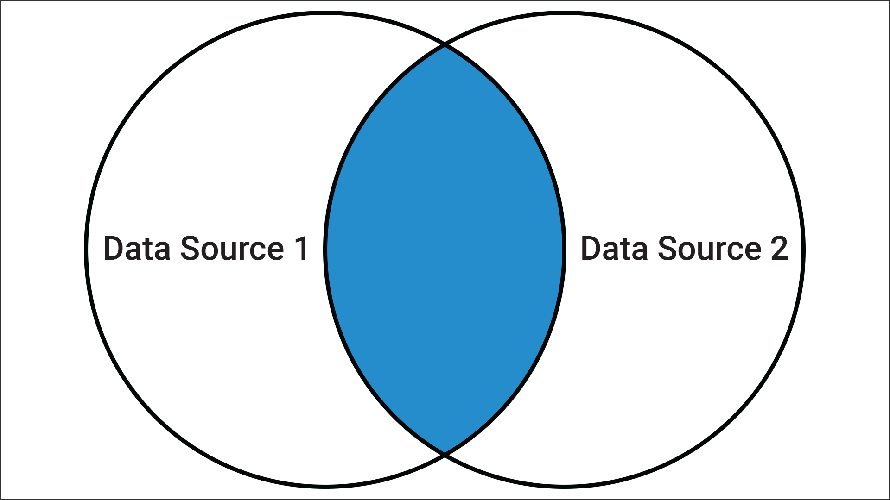
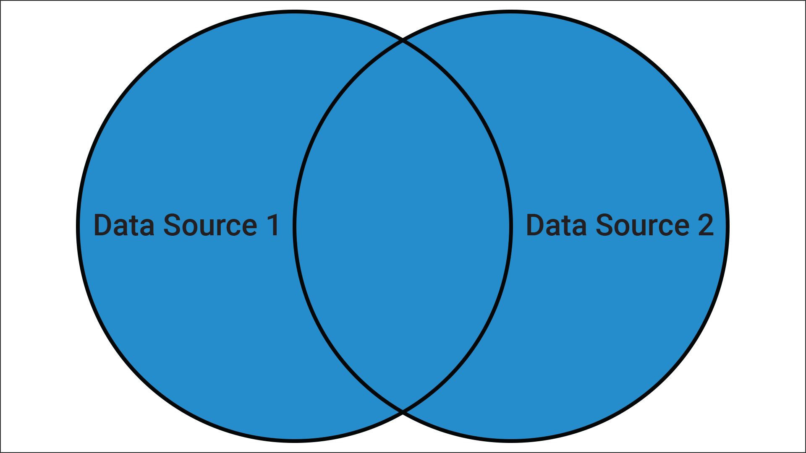
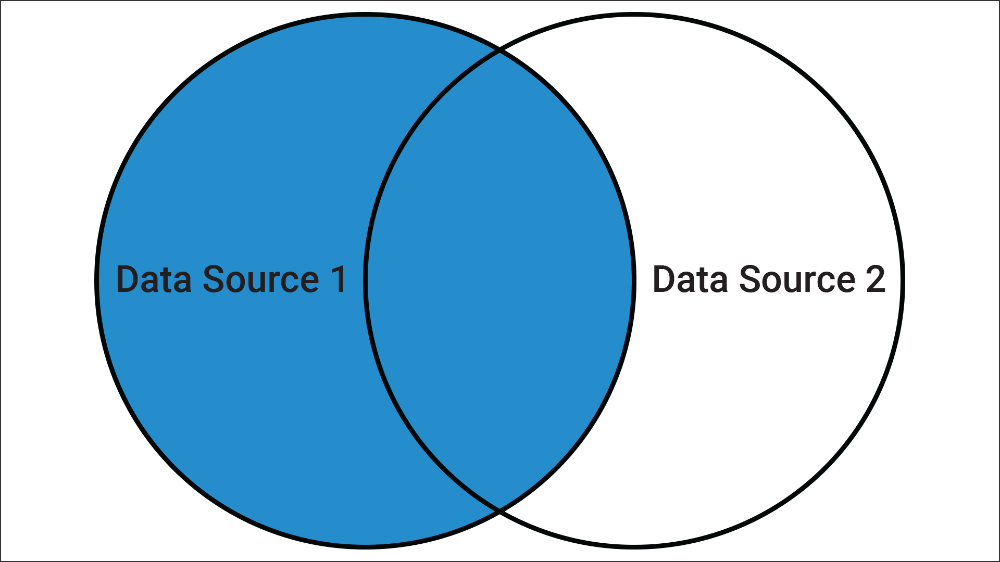
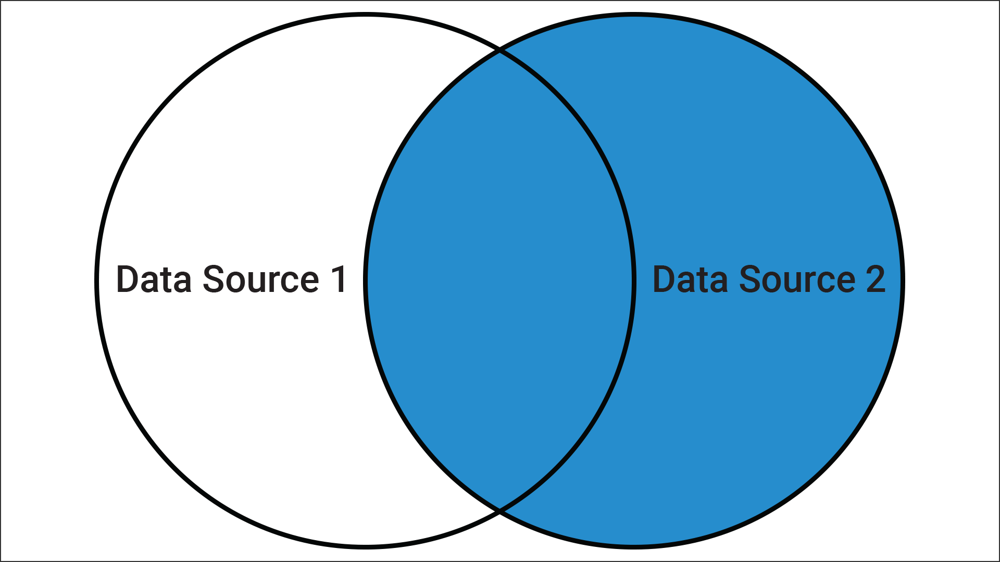

# Electronics Store Orders

In this activity, you will merge Pandas DataFrames. Inner, outer, left and right joins are important concepts to understand, as they are also used with other technologies. 

## Instructions

1. Create two variables with the file name.

2. Read the files and insert them into the `customers_df` and `orders_df` DataFrames.

3. Display the DataFrame using the `.head()` function on the DataFrames.

4. For each of the following merges, print out the results of the merge and the size of the DataFrame using the `size()` function.

   * Merge the `customers_df` and the `orders_df` DataFrames using an inner join.

     

   * Merge the `customers_df` and the `orders_df` DataFrames using an outer join.

     

   * Merge the `customers_df` and the `orders_df` DataFrames using a left join.

     

   * Merge the `customers_df` and the `orders_df` DataFrames using a right join.

      

---

© 2021 Trilogy Education Services, a 2U, Inc. brand. All Rights Reserved.
